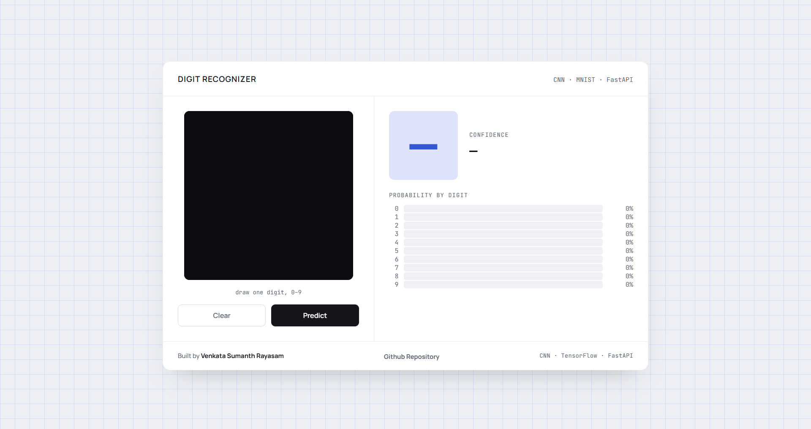
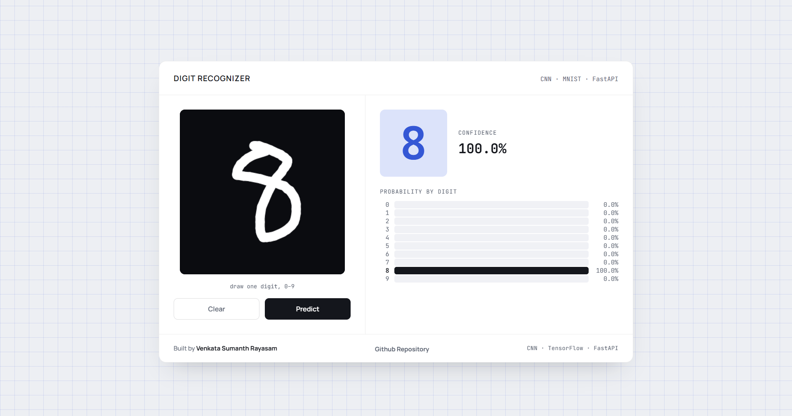

# Digit Recognizer

A handwritten digit recognizer that runs entirely in the browser. Draw a digit
with your mouse or finger, and a CNN trained on MNIST predicts what you drew
in real time — complete with a full confidence breakdown across all ten
digits.

Live demo: https://digit-recognizer-webapp.onrender.com

## Screenshots

### Before prediction



### After prediction



---

## Table of contents

- [Digit Recognizer](#digit-recognizer)
  - [Screenshots](#screenshots)
    - [Before prediction](#before-prediction)
    - [After prediction](#after-prediction)
  - [Table of contents](#table-of-contents)
  - [Overview](#overview)
  - [Features](#features)
  - [Tech stack](#tech-stack)
  - [Project structure](#project-structure)
  - [How it works](#how-it-works)
  - [Getting started](#getting-started)
    - [Prerequisites](#prerequisites)
    - [Train the model](#train-the-model)
    - [Run locally with Python](#run-locally-with-python)
    - [Run locally with Docker](#run-locally-with-docker)
  - [API reference](#api-reference)
    - [`POST /predict`](#post-predict)
  - [Deployment](#deployment)
  - [Troubleshooting](#troubleshooting)
  - [Roadmap](#roadmap)
  - [License](#license)

---

## Overview

This project pairs a convolutional neural network trained on the MNIST
dataset with a single-page web interface built on FastAPI. There's no
desktop GUI, no screen-capture hacks — you draw directly on an HTML canvas,
the browser sends the pixel data to a `/predict` endpoint, and the model
responds with its best guess plus a probability for every digit 0–9.

## Features

- **Draw and predict instantly** — predictions fire automatically as soon as
  you lift the pen, no extra clicks needed.
- **Full probability breakdown** — see exactly how confident the model was
  across all ten digits, not just the winning one.
- **MNIST-accurate preprocessing** — your drawing is cropped to its bounding
  box, scaled, and centered by center of mass before being fed to the model,
  matching the exact convention MNIST digits were built with. This is the
  difference between a demo that mostly guesses "8" and one that actually
  works.
- **Single-page UI** — no page reloads, no separate frontend build step, just
  one HTML file served by the API itself.
- **Container-ready** — ships with a `Dockerfile` for identical behavior
  locally and in production.

## Tech stack

| Layer | Technology |
|---|---|
| Model | TensorFlow / Keras (CNN) |
| Backend | FastAPI + Uvicorn |
| Frontend | Vanilla HTML/CSS/JS (canvas API) |
| Image handling | Pillow, NumPy |
| Packaging | Docker |

## Project structure

```
digit-recognizer/
├── app/
│   ├── main.py               # FastAPI app: loads the model, exposes POST /predict
│   └── static/
│       └── index.html        # Single-page UI — canvas, live prediction, probability bars
│
├── model/
│   ├── train.py               # Builds, trains, and saves the CNN
│   └── saved_models/
│       ├── best_mnist_model.h5    # Best checkpoint during training
│       └── mnist_cnn_model.h5     # Final model, loaded by the API
│
├── tests/                     # API/model tests
├── Dockerfile                 # Container build for local + cloud deployment
├── .dockerignore
├── requirements.txt
├── .gitignore
└── README.md
```

## How it works

```
 Browser canvas          FastAPI (/predict)              CNN model
┌────────────────┐      ┌──────────────────────┐      ┌─────────────┐
│ draw digit      │ ───► │ decode base64 PNG     │ ───► │ predict()   │
│ (white on black)│      │ crop to bounding box   │      │             │
│                 │      │ scale to 20x20         │      │             │
│                 │      │ center by mass in 28x28│      │             │
└────────────────┘      └──────────────────────┘      └──────┬──────┘
                                                                │
                          digit + confidence + probabilities ◄─┘
```

1. You draw on a 320×320 black canvas with a white pen — matching MNIST's
   white-digit-on-black-background convention.
2. On stroke release, the canvas is exported as a base64 PNG and POSTed to
   `/predict`.
3. The backend crops the image to the drawn strokes' bounding box, rescales
   it to fit a 20×20 box (preserving aspect ratio), and pastes it into a
   28×28 frame centered by center of mass — the same pipeline used to build
   the original MNIST dataset.
4. The CNN returns a probability for each digit; the highest one is shown as
   the prediction, and all ten populate the bar chart.

## Getting started

### Prerequisites

- Python 3.10+
- pip
- (Optional) Docker Desktop, if you'd rather run it containerized

### Train the model

```bash
pip install -r requirements.txt
python model/train.py
```

This downloads MNIST automatically, trains the CNN with data augmentation,
and saves two files into `model/saved_models/`:

- `best_mnist_model.h5` — best checkpoint during training (early stopping)
- `mnist_cnn_model.h5` — final model, the one the API actually loads

Training typically takes a few minutes on CPU, faster with a GPU.

### Run locally with Python

```bash
python -m venv venv
venv\Scripts\activate        # macOS/Linux: source venv/bin/activate
pip install -r requirements.txt

uvicorn app.main:app --reload
```

Then open **http://127.0.0.1:8000** in your browser — that's a separate
manual step, the command above only starts the server.

### Run locally with Docker

```bash
docker build -t digit-recognizer .
docker run -p 8000:8000 digit-recognizer
```

Open **http://localhost:8000**. (Not `0.0.0.0:8000` — that's the address the
server binds to *inside* the container, not something your browser can
visit directly.)

## API reference

### `POST /predict`

Accepts a base64-encoded canvas image, returns the predicted digit and full
probability distribution.

**Request body**

```json
{
  "image": "data:image/png;base64,iVBORw0KGgoAAAANSUhEUgAA..."
}
```

**Response**

```json
{
  "digit": 7,
  "confidence": 0.9821,
  "probabilities": [0.0001, 0.0003, 0.0012, 0.0008, 0.0041,
                     0.0009, 0.0002, 0.9821, 0.0031, 0.0072]
}
```

| Field | Type | Description |
|---|---|---|
| `digit` | integer | The predicted digit, 0–9 |
| `confidence` | float | Probability of the predicted digit (0–1) |
| `probabilities` | float[10] | Full softmax output, indexed by digit |

## Deployment

This project deploys as-is to any Docker-friendly host (Render, Railway,
Fly.io, a plain VPS). General steps:

1. Make sure `model/saved_models/mnist_cnn_model.h5` is committed to git —
   it must **not** be gitignored, since the container image needs it.
2. Push the repo to GitHub.
3. On your host, create a new web service pointing at the repo. Most
   platforms auto-detect the `Dockerfile` and need no further config.
4. The app reads the `PORT` environment variable automatically (see
   `Dockerfile` / `app/main.py`), so it works with whatever port the
   platform assigns.

On free tiers (e.g. Render's free plan), expect the service to spin down
after a period of inactivity and take 30–60 seconds to wake up on the next
request — that's expected behavior, not a bug.

## Troubleshooting

| Symptom | Likely cause |
|---|---|
| Predictions are almost always "8" | Preprocessing mismatch — make sure you're running the version with bounding-box crop + center-of-mass centering in `app/main.py` |
| `Model file not found` on startup | `mnist_cnn_model.h5` is missing from `model/saved_models/` — run `python model/train.py` first |
| Browser can't reach `0.0.0.0:8000` | Use `localhost:8000` or `127.0.0.1:8000` instead — `0.0.0.0` is a bind address, not a browsable one |
| Docker build/run fails with a pipe error on Windows | Docker Desktop isn't running, or WSL2 needs updating (`wsl --update` in an admin PowerShell, then reboot) |
| Renamed the Render service but the URL didn't change | Known Render limitation — renaming only updates the dashboard label, not the `.onrender.com` subdomain. Delete and recreate the service with the desired name, or attach a custom domain instead |

## Roadmap

- [ ] Add automated tests for `/predict` and the preprocessing pipeline
- [ ] Support touch-drawing polish for mobile devices
- [ ] Add a confusion matrix / model evaluation report to the repo
- [ ] Optional: swap in a deeper architecture and compare accuracy

## License

This project is open-source and available under the MIT License.

---

Built by **Venkata Sumanth Rayasam** · CNN · TensorFlow · FastAPI